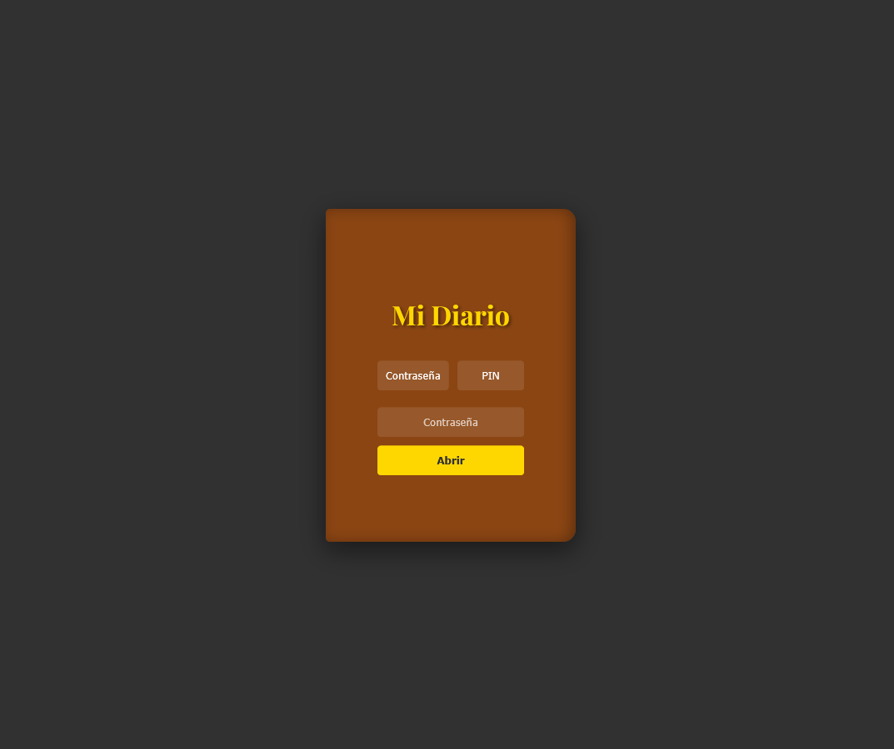
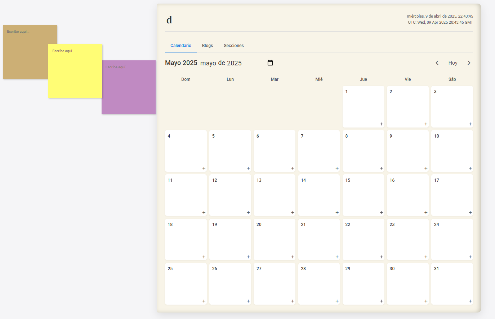
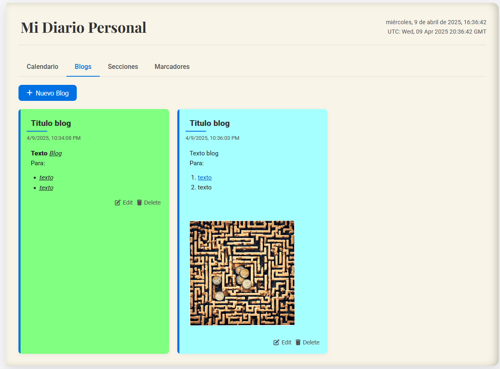

# Diario Personal Web App

[](https://shields.io/)
[](https://creativecommons.org/licenses/by-nc-nd/4.0/)

**Nota:** Este proyecto se encuentra actualmente en desarrollo activo.

Diario Personal es una aplicación web completa para organizar tu vida personal con calendario, blogs, marcadores y notas adhesivas.

[📥 Demo (Alpha)](https://sircrehnas.github.io/DiarioApp_Web/)

## ✨ Características Principales

✅ Sistema de autenticación con contraseña/PIN

✅ Calendario interactivo con eventos

✅ Blogs personales con editor enriquecido

✅ Post-its arrastrables y anclables

✅ Sistema de secciones para organización

✅ Marcadores de enlaces favoritos

✅ Widgets personalizables

✅ Exportación/importación de datos

✅ Temas claro/oscuro

✅ Multidioma (ES/EN)

## 🖥️ Capturas de Pantalla





## 🚀 Cómo Usar

1.  **Versión local**:
    ```bash
    git clone https://github.com/SircRehnas/DiarioApp_Web.git
    cd DiarioApp_Web

    # Abre el archivo index.html en tu navegador web preferido
    ```
    Credenciales predeterminadas:
    * Contraseña: `DiarioApp`
    * PIN: `1234`

## 🛠️ Tecnologías

* **Frontend:** HTML5, CSS3, JavaScript (Vanilla JS)
* **Iconos:** Font Awesome 6
* **Fuentes:** Google Fonts (Playfair Display, Roboto)
* **Almacenamiento:** `LocalStorage` del navegador
* **Compatibilidad:** Navegadores modernos (Chrome, Firefox, Edge, Safari)

## 🎨 Diseño Premium

Diario Personal ofrece una experiencia visual premium con:

* Efectos 3D en el sistema de login.
* Animaciones fluidas en cada interacción.
* Temas personalizables (claro/oscuro).
* Micro-interacciones que mejoran la usabilidad.
* Diseño completamente responsive (adaptable a diferentes tamaños de pantalla).

## 📜 Licencia

Diario Personal Web © 2025 by ThianDev (GitHub: SircRehnas) is licensed under `CC BY-NC-ND 4.0`.
[Ver licencia completa](https://creativecommons.org/licenses/by-nc-nd/4.0/)


[](https://creativecommons.org/licenses/by-nc-nd/4.0/?ref=chooser-v1)
[](https://creativecommons.org/licenses/by-nc-nd/4.0/?ref=chooser-v1)
[](https://creativecommons.org/licenses/by-nc-nd/4.0/?ref=chooser-v1)
[](https://creativecommons.org/licenses/by-nc-nd/4.0/?ref=chooser-v1)

## 📜 Datos de atribución

* **Título de la obra:** DiarioApp_Web
* **Nombre de desarrollador:** SircRehnas (ThianDev)
* **Enlace a la obra:** [https://github.com/SircRehnas/DiarioApp_Web](https://github.com/SircRehnas/DiarioApp_Web)
* **Enlace al GitHub del creador:** [SircRehnas](https://github.com/SircRehnas)
* **Año de creación:** 2025

## ❗Términos Adicionales
EL SOFTWARE SE PROPORCIONA "TAL CUAL", SIN GARANTÍA DE NINGÚN TIPO.
Queda prohibido:
1. Uso comercial sin permiso
2. Distribución de versiones modificadas
3. Omitir atribución al autor

## 👨‍💻 Desarrollador

* **ThianDev** - [GitHub: SircRehnas](https://github.com/SircRehnas)

## 📅 Roadmap
- [x] Versión inicial
- [ ] Implementar autenticación
- [ ] Mejorar sistema de notificaciones
- [ ] Sincronización en la nube
- [ ] Diseño móvil

* **Versión 1.0** - Funcionalidades básicas completas (Calendario, Blogs, Secciones, Marcadores, Post-its, Configuración, Seguridad básica, Exportar/Importar).
* **Versión 2.0** - Mejoras de organización y UI/UX.
    * Autenticación mejorada (opciones de recuperación).
    * Filtros avanzados y búsqueda.
    * Widgets personalizables en dashboard.
* **Futuro (Post V2.0)**
    * Posible sincronización en la nube (requeriría backend).
    * Versión móvil optimizada o PWA (Progressive Web App).

## ❓ FAQ (Preguntas Frecuentes)

<details>
  <summary>🔽 ¿Cómo cambio la contraseña o el PIN?</summary>
  Ve a `Configuración` → `Seguridad`. Allí encontrarás las opciones para cambiar tanto la contraseña como el PIN.
</details>

<details>
  <summary>🔽 ¿Dónde se guardan mis datos?</summary>
  Todos los datos (entradas de blog, eventos, notas, etc.) se guardan exclusivamente de forma local en el almacenamiento de tu navegador (`LocalStorage`). Esto significa que los datos están solo en el dispositivo y navegador que usas. **Es crucial exportar tus datos regularmente** como copia de seguridad, ya que limpiar la caché del navegador o usar un navegador diferente resultará en la pérdida de datos.
</details>

<details>
  <summary>🔽 ¿Cómo anclo un post-it a un blog o evento?</summary>
  1. Haz clic en el icono de la chincheta (📌) que aparece en la esquina del Post-it.
  2. Selecciona si quieres anclarlo a un "Blog" o a un "Evento del Calendario".
  3. Elige el blog o evento específico de la lista desplegable que aparecerá. El Post-it quedará vinculado a ese elemento.
</details>

<details>
  <summary>🔽 ¿Cómo cambio al tema oscuro?</summary>
  Ve a `Configuración` → `Apariencia`. En la sección `Tema`, selecciona la opción `Oscuro`. El cambio se aplicará inmediatamente.
</details>

## 📚 Documentación Adicional

* [Guía Técnica](guia_tecnica.html)
* [Manual de Usuario](manual_usuario.html)
* [Changelog](CHANGELOG.md)

## 🐛 Reportar Problemas

Si encuentras algún error (bug), tienes problemas con alguna funcionalidad o quieres sugerir una mejora:

1.  **Verifica si ya existe un issue similar** en la [sección de Issues del repositorio](https://github.com/SircRehnas/DiarioApp_Web/issues).
2.  Si no existe uno similar, **crea un nuevo issue**.
3.  Por favor, incluye la siguiente información en tu reporte:
    * Pasos detallados para reproducir el problema.
    * Qué resultado esperabas y qué resultado obtuviste.
    * Una captura de pantalla o GIF (si es relevante y ayuda a visualizar el problema).
    * El navegador web y su versión que estás utilizando (Ej: Chrome 115, Firefox 114).

---

## 🤝 Contribuciones

Aunque este es un proyecto personal, se agradecen sugerencias y feedback. Si deseas contribuir con código:

1. Haz un **fork** del repositorio.
2. Crea una nueva rama para tu característica (`git checkout -b feature/AmazingFeature`).
3. Realiza tus cambios y haz **commit** de ellos (`git commit -m 'Add some AmazingFeature'`).
4. Haz **push** a tu rama (`git push origin feature/AmazingFeature`).
5. Abre un **Pull Request** en el repositorio original.

## 🌍 Internacionalización

Actualmente soportamos los siguientes idiomas:
- Español (ES) - idioma predeterminado
- Inglés (EN)

¿Quieres ayudar a traducir la aplicación a otros idiomas? ¡Ponte en contacto o abre un Pull Request con los archivos de idioma correspondientes!

## ⚠️ Limitaciones Conocidas

- **Persistencia de datos**:
  - Los datos **solo** se guardan localmente en el `LocalStorage` del navegador que estás utilizando.
  - Los datos **se perderán permanentemente** si limpias la caché del navegador, los datos del sitio, o si utilizas un modo incógnito/privado. **¡Exporta tus datos regularmente!**
- **Tamaño de almacenamiento**:
  - `LocalStorage` tiene un límite de tamaño (generalmente alrededor de 5-10MB por dominio, varía según el navegador).
  - Blogs extremadamente largos o un número muy elevado de entradas/eventos podrían eventualmente alcanzar este límite.

## 🔐 Recomendaciones de Seguridad

1. **Cambia la contraseña y el PIN predeterminados** inmediatamente después del primer uso (`Configuración` → `Seguridad`).
2. **No compartas tus archivos de exportación** (`.json`), ya que contienen toda tu información personal del diario.
3. **Realiza exportaciones de seguridad regularmente** y guárdalas en un lugar seguro (diferente al dispositivo donde usas la app).
4. Si decides alojar o modificar tu propia versión, asegúrate de usar **contraseñas únicas y fuertes**.

## 📱 Compatibilidad con Dispositivos

La aplicación ha sido probada y funciona correctamente en las últimas versiones de los siguientes navegadores:
- Google Chrome
- Mozilla Firefox
- Microsoft Edge
- Safari 14+

También está diseñada para ser responsive y funcionar en dispositivos móviles con un ancho de pantalla (viewport) de al menos `320px`.

## 🧰 Dependencias Externas

Este proyecto utiliza las siguientes librerías y recursos externos:
- [Font Awesome](https://fontawesome.com/) - Para los iconos utilizados en toda la interfaz.
- [Google Fonts](https://fonts.google.com/) - Para las tipografías `Playfair Display` y `Roboto`.
- [Normalize.css](https://necolas.github.io/normalize.css/) - Para asegurar una representación consistente de los elementos HTML entre diferentes navegadores (incluido directamente en el CSS).

## 📅 Historial de Versiones

Para un registro detallado de los cambios realizados en cada versión, por favor consulta el archivo [CHANGELOG.md](CHANGELOG.md).

## 📬 Contacto

Para consultas técnicas, sugerencias o posibles colaboraciones:
- **GitHub Issues:** [Abrir un issue](https://github.com/SircRehnas/DiarioApp_Web/issues) (Método preferido para bugs y sugerencias)
- **GitHub Profile:** [@SircRehnas](https://github.com/SircRehnas)
- **Twitter:** [@ThianDev](https://twitter.com/ThianDev) (Si está disponible y activo)
- **Email:** Puedes encontrar la dirección de correo electrónico en el perfil de GitHub si ha sido publicada.

---

**¡Gracias por usar Diario Personal Web App!**
<br>
Si encuentras útil este proyecto, considera darle una estrella ⭐ en [GitHub](https://github.com/SircRehnas/DiarioApp_Web). ¡Se agradece mucho el apoyo!
